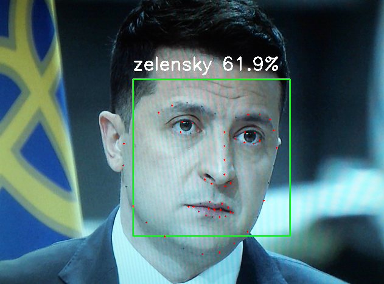

# face recognition

Just a couple of tests for trying to make a facial recognition program that correctly classifies different people's faces

It currently looks like this:

<div style='text-align: center;' align='center'>
    
</div>

And its performance in terms of predictions' confidence is this:

<div style='text-align: center;' align='center'>
    
</div>

## Installation

Before anything can run, you need to create a Python virtual environment & install the dependencies:

```
$ python -m venv env
$ pip install -r requirements.txt
```

Note: for installing the *dlib* library, follow [this tutorial](https://www.youtube.com/watch?v=eaEndTeUiSU&ab_channel=crazzylearners).

## Usage

Firstly, run the training program within this repo, locating all faces inside the `faces/` directory, and naming each person's faces folder accordingly (just immitate the given folder structure):

```
$ python faces-train.py
```

Then, go ahead and run the webcam-capture recognizer:

```
$ python cv.py
```
